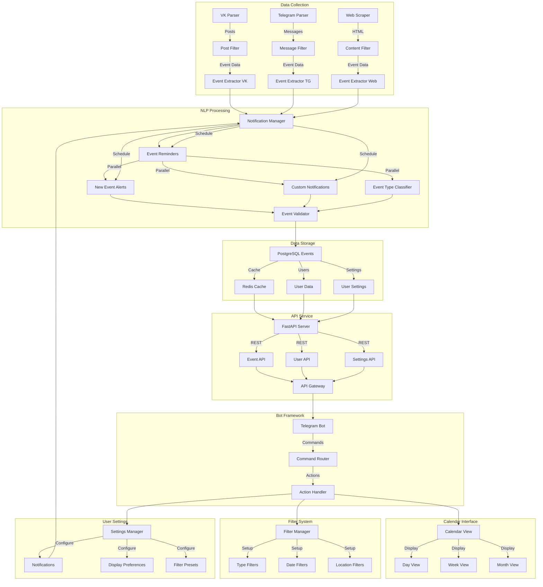

# LectureRadar 🎯

A Telegram bot that helps you discover and attend scientific lectures and events in Moscow. The bot aggregates information about scientific events (lectures, schools, workshops) from various sources (VK, Telegram, websites) and presents them in a customizable calendar interface.

## Project Vision 🚀

LectureRadar aims to create a centralized platform for discovering academic and scientific events in Moscow, making it easier for knowledge enthusiasts to:
- Find relevant lectures and workshops
- Get personalized event recommendations
- Connect with fellow learners
- Never miss important educational opportunities

## System Architecture 📐

Below is the preliminary system architecture diagram. This design may evolve as the project develops:



## Features 🌟

### Core Functionality
- **Multi-Source Event Aggregation**: Automatically collects scientific events from:
  - VK public pages
  - Telegram channels
  - Educational websites
- **Smart Notifications**: Receive personalized notifications about upcoming events based on your interests
- **Interactive Calendar**: View and manage events in a convenient calendar interface
- **Location-Based Updates**: Get informed about events happening near you

### Social Features
- **Meetup Organization**: Create and join meetups with other lecture enthusiasts
- **Random Coffee Matching**: Find lecture companions through our random matching system
- **Community Building**: Connect with like-minded individuals interested in scientific lectures

### Personalization
- **Interest-Based Filtering**: Set your preferred topics and receive relevant event notifications
- **Custom Schedule**: Configure notification timing based on your availability
- **Event History**: Keep track of lectures you've attended and save ones for later

## Getting Started 🚀

### Prerequisites
- Python 3.8+
- Telegram account
- API keys (details in setup section)

### Installation

1. Clone the repository
```bash
git clone https://github.com/zavesone/LectureRadar.git
cd LectureRadar
```

2. Install dependencies
```bash
pip install -r requirements.txt
```

3. Configure environment variables
```bash
cp .env.example .env
# Edit .env with your API keys and configuration
```

## Contributing 🤝

We welcome contributions! Whether you're interested in:
- Backend development (Python, FastAPI)
- NLP and data processing
- Frontend and UI/UX design
- Documentation and testing

Here's how you can help:

1. Fork the repository
2. Create a feature branch (`git checkout -b feature/AmazingFeature`)
3. Commit your changes (`git commit -m 'Add some AmazingFeature'`)
4. Push to the branch (`git push origin feature/AmazingFeature`)
5. Open a Pull Request

## License 📝

This project is licensed under the MIT License - see the [LICENSE](LICENSE) file for details.

## Contact 📮

Project Link: [https://github.com/zavesone/LectureRadar](https://github.com/zavesone/LectureRadar)

## Acknowledgments 🙏

- Thanks to all the educational institutions in Moscow for providing event information
- Contributors and community members
- Libraries and tools used in this project