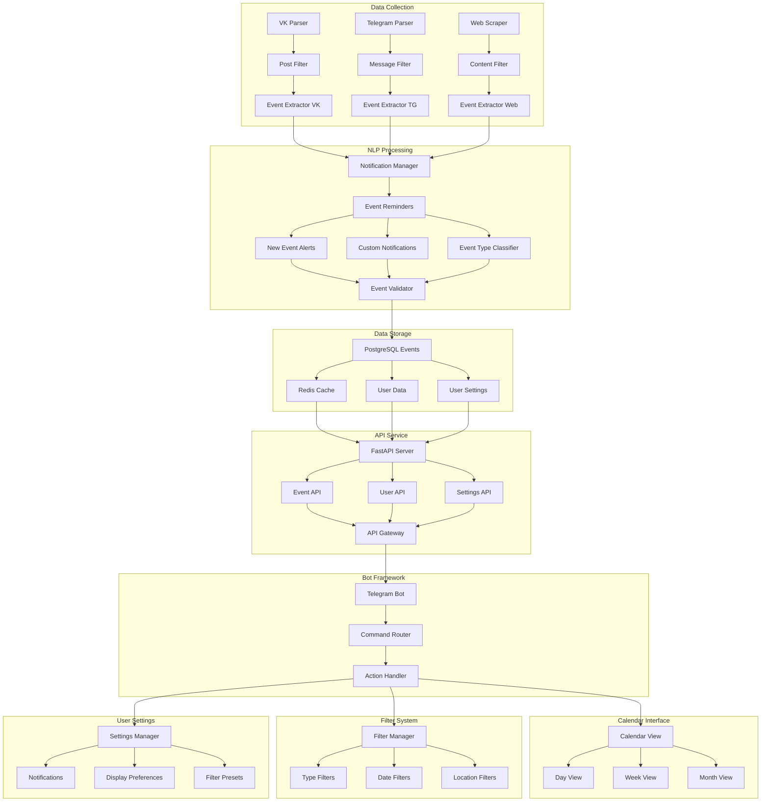

Here's the complete README content with all the improvements, including the mermaid diagram. The content is formatted and ready to paste:

# LectureRadar 🎯

A Telegram bot that helps you discover and attend scientific events (lectures, schools, workshops) in Moscow. Never miss an interesting lecture again!

## Project Vision 🚀

LectureRadar aims to create a centralized platform for discovering academic and scientific events in Moscow, making it easier for knowledge enthusiasts to:
- Find relevant lectures and workshops from multiple sources
- Get personalized event recommendations
- Connect with fellow learners
- Access a unified calendar of academic events

## Development Status ⚡

This project is currently in active development. We are working on:
- Core data collection infrastructure
- Event parsing and classification
- Bot interface development
- Calendar integration

## System Architecture 📐



*Note: This is a preliminary system architecture that may evolve as the project develops.*

## Features 🌟

### Core Features
- **Multi-Source Event Aggregation**: Automatically collects events from VK, Telegram, and educational websites
- **Smart Filtering**: Uses NLP to classify and categorize events
- **Interactive Calendar**: Customizable calendar interface for event management
- **Personalized Notifications**: Get alerts based on your interests and preferences

### Upcoming Features
- Location-based event suggestions
- Event rating and recommendations
- Community features and event companion matching
- Integration with popular calendar apps

## Tech Stack 💻

- **Backend**: Python, FastAPI
- **Database**: PostgreSQL, Redis
- **NLP**: spaCy/NLTK
- **Bot Framework**: python-telegram-bot
- **Frontend**: Telegram Bot API

## Getting Started 🏃‍♂️

### Prerequisites
- Python 3.8+
- PostgreSQL
- Redis
- Telegram Bot Token

### Quick Start
1. Clone the repository
```bash
git clone https://github.com/zavesone/LectureRadar.git
cd LectureRadar
```

2. Install dependencies
```bash
pip install -r requirements.txt
```

3. Set up environment variables
```bash
cp .env.example .env
# Edit .env with your configuration
```

## Contributing 🤝

We welcome contributions! If you're interested in:
- Backend development
- NLP and data processing
- Bot interface design
- Documentation and testing

See our [Contributing Guidelines](CONTRIBUTING.md) for more details.

## Documentation 📚

- [API Documentation](docs/API.md)
- [Development Setup](docs/DEVELOPMENT.md)
- [Bot Commands](docs/COMMANDS.md)

## Contact 📧

- GitHub Issues: For bug reports and feature requests
- Telegram: @lectureradar_admin
- Email: [coming soon]

## License 📝

This project is under development. License details will be added soon.
