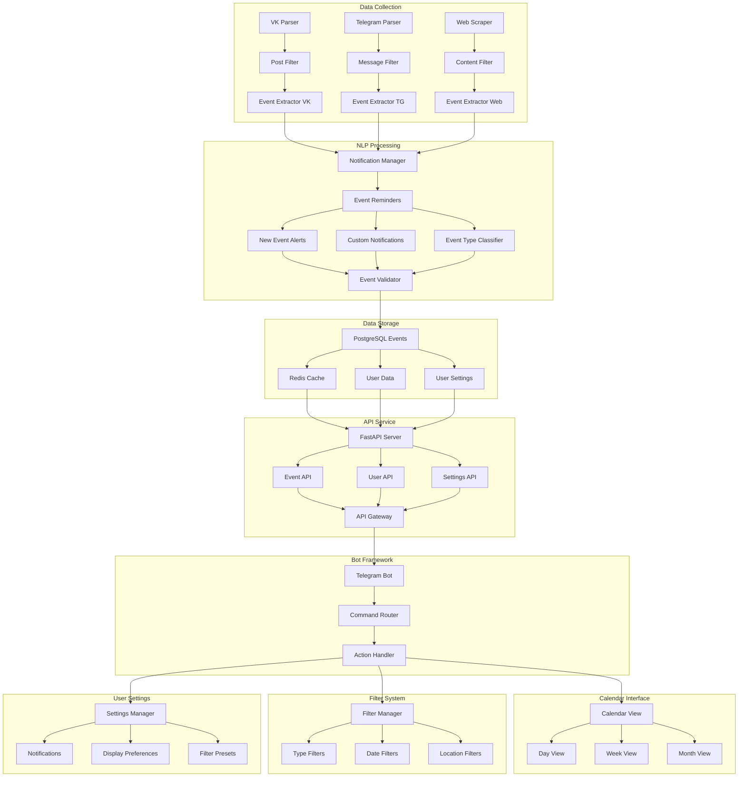

# LectureRadar

A Telegram bot that helps you discover and attend scientific events (lectures, schools, workshops) in Moscow by aggregating information from various sources (VK, Telegram, websites) and presenting them in a customizable calendar interface.

## System Architecture 

*Note: This is a preliminary system architecture that may evolve as the project develops.*

## Features

### Data Collection
- VK public pages parser
- Telegram channels parser
- Website scraper
- Content filtering and validation

### Event Processing
- NLP-based event classification
- Smart notification system
- Event validation and enrichment
- Custom reminder system

### User Interface
- Interactive calendar views
- Flexible filtering system
- Customizable notifications
- User preference management

## Tech Stack

- Backend: Python, FastAPI
- Database: PostgreSQL, Redis
- NLP: spaCy/NLTK
- Bot Framework: python-telegram-bot
- Frontend: Telegram Bot API

## Getting Started

[Installation and setup instructions will be added]

## Contributing

We welcome contributions! Whether you're interested in:
- Backend development
- NLP and data processing
- Bot interface design
- Documentation and testing

Please reach out if you'd like to contribute.

## License

This project is under development. License details will be added soon.
